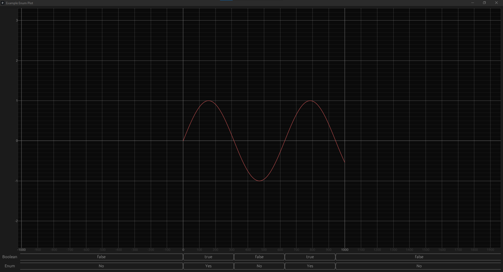

# Enum Plotting Addon for EGUI Plot
Allows for the plotting of nonnumeric values under a egui plot, in the style of a digital waveform viewer.
See simple_plot.rs in the examples directory for simple usage.

